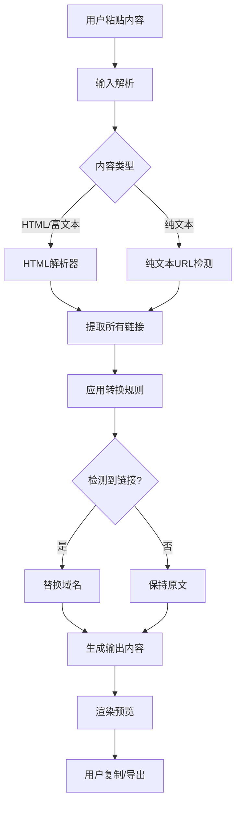

# 论坛链接转换工具 - PRD 产品需求文档

> 版本：V1.0
> 日期：2026-02-14

---

## 1. 核心目标 (Mission)

帮助用户将论坛内容迁移过程中的超链接一键转换为目标平台的链接。

---

## 2. 用户画像 (Persona)

| 维度 | 描述 |
|------|------|
| **目标用户** | 论坛/社区运营者、知识库管理者 |
| **核心痛点** | 从旧平台复制内容后，超链接仍指向旧平台，需要手动一个个修改 |
| **使用场景** | 论坛迁移、内容导入、知识库整理 |

---

## 3. V1: 最小可行产品 (MVP)

### 3.1 核心功能清单

1. **链接识别**
   - 自动检测内容中的所有超链接
   - 支持 HTML/富文本格式
   - 支持纯文本格式

2. **域名替换**
   - 将原域名替换为新域名
   - 保留原路径不变

3. **实时预览**
   - 左侧显示原文
   - 右侧显示转换结果
   - 高亮显示变化的链接

4. **一键复制/导出**
   - 复制转换后的内容到剪贴板
   - 导出为文件（HTML/TXT）

5. **批量处理**
   - 支持批量导入多条内容
   - 逐条预览和转换

### 3.2 MVP原型设计

```
┌─────────────────────────────────────────────────────────────────┐
│  链接转换工具                                    [设置] [导出] │
├───────────────────┬─────────────────────┬───────────────────────┤
│                   │     转换配置        │                       │
│    输入内容        │  ┌─────────────┐   │    转换结果           │
│                   │  │ 原域名:     │   │                       │
│  [粘贴或输入内容]  │  │ itsk.com    │   │  [实时预览结果]        │
│                   │  │             │   │                       │
│                   │  │ 新域名:     │   │  高亮显示:             │
│                   │  │ 192.168.x.x │   │  替换的链接            │
│                   │  └─────────────┘   │                       │
│                   │                     │                       │
│                   │  [开始转换]         │  [复制结果]            │
├───────────────────┴─────────────────────┴───────────────────────┤
│  状态: 已识别 3 个链接                                          │
└─────────────────────────────────────────────────────────────────┘
```

### 3.3 界面说明

- **左侧 - 输入区域**：粘贴或输入待转换的内容
- **中间 - 配置区**：配置原域名和新域名，点击转换按钮
- **右侧 - 预览区**：实时显示转换结果，替换的链接高亮标记
- **顶部 - 菜单**：设置、导出功能入口
- **底部 - 状态栏**：显示识别的链接数量

---

## 4. V2 及以后版本 (Future Releases)

| 序号 | 功能 | 描述 |
|------|------|------|
| 1 | **规则引擎** | 支持正则表达式配置复杂转换规则 |
| 2 | **链接映射表** | 手动建立旧链接→新链接的对应关系 |
| 3 | **多平台预设** | 预设常见论坛/CMS的链接格式 |
| 4 | **历史记录** | 保存转换历史，支持撤销 |
| 5 | **插件系统** | 支持自定义转换逻辑 |

---

## 5. 关键业务规则 (Business Rules)

### 5.1 转换规则

| 规则 | 说明 |
|------|------|
| 域名替换 | 将配置的原域名替换为新域名 |
| 路径保留 | 保持URL路径部分不变 |
| 协议处理 | 根据新域名配置自动适配http/https |
| 顺序执行 | 从上到下依次处理所有识别的链接 |

### 5.2 配置存储

- 配置文件格式：JSON
- 存储位置：本地应用数据目录
- 配置内容：原域名、新域名、历史记录

---

## 6. 数据契约 (Data Contract)

### 6.1 输入数据

| 类型 | 格式 | 示例 |
|------|------|------|
| HTML片段 | HTML字符串 | `<p>点击<a href="https://itsk.com/thread/401140">这里</a></p>` |
| 富文本 | HTML | 同上 |
| 纯文本 | 纯文本 | `访问 https://itsk.com/thread/401140 了解更多` |

### 6.2 输出数据

| 类型 | 格式 | 示例 |
|------|------|------|
| 转换结果 | 与输入同格式 | `<p>点击<a href="http://192.168.1.168:8090/thread/401140">这里</a></p>` |
| 链接报告 | JSON数组 | `[{"original": "...", "converted": "...", "changed": true}]` |

### 6.3 配置数据

```json
{
  "sourceDomain": "itsk.com",
  "targetDomain": "192.168.1.168:8090",
  "sourceProtocol": "https",
  "targetProtocol": "http"
}
```

---

## 7. 架构设计

### 7.1 技术选型

| 类别 | 选择 | 理由 |
|------|------|------|
| 桌面框架 | Tauri | 轻量级、跨平台、安装包小 |
| 前端框架 | React + TypeScript | 组件化、类型安全 |
| 样式方案 | Tailwind CSS | 快速开发、响应式 |
| HTML解析 | cheerio | 轻量、稳定 |

### 7.2 核心流程图



### 7.3 组件模块说明

| 模块 | 职责 | 关键方法 |
|------|------|---------|
| `LinkConverter` | 链接转换核心逻辑 | `convert(content, config)` |
| `ContentParser` | 内容解析（HTML/纯文本） | `parse(html)`, `parsePlain(text)` |
| `LinkExtractor` | 提取内容中的链接 | `extract(html)` |
| `DomainReplacer` | 域名替换 | `replace(url, config)` |
| `ConfigManager` | 配置管理 | `load()`, `save(config)` |

### 7.4 文件结构

```
src/
├── components/
│   ├── InputPanel.tsx      # 输入面板
│   ├── ConfigPanel.tsx     # 配置面板
│   ├── OutputPanel.tsx     # 输出预览
│   ├── StatusBar.tsx       # 状态栏
│   └── App.tsx             # 主应用
├── core/
│   ├── linkConverter.ts    # 转换核心
│   ├── contentParser.ts    # 内容解析
│   ├── linkExtractor.ts    # 链接提取
│   ├── domainReplacer.ts   # 域名替换
│   └── configManager.ts    # 配置管理
└── types/
    └── index.ts            # 类型定义
```

### 7.5 技术风险与应对

| 风险 | 影响 | 应对方案 |
|------|------|---------|
| HTML解析破坏格式 | 转换后排版错乱 | 使用稳定的HTML解析库，保持DOM结构 |
| 特殊字符处理 | URL中的参数被错误解析 | 严格URL编码/解码 |
| 大批量处理性能 | 卡顿或超时 | 分批处理 + Web Worker |

---

## 8. 验收标准

### 8.1 功能验收

- [ ] 能够正确识别HTML中的超链接
- [ ] 能够正确识别纯文本中的URL
- [ ] 域名替换正确，路径保留
- [ ] 转换后格式与原文一致
- [ ] 支持批量导入
- [ ] 支持复制和导出

### 8.2 体验验收

- [ ] 界面布局清晰，三栏结构直观
- [ ] 转换操作流畅，实时预览无延迟
- [ ] 替换的链接有明确的高亮标识

---

## 9. 后续计划

确认本PRD后，开发团队将按照以下顺序实现：

1. 项目初始化（Tauri + React）
2. 核心转换逻辑开发
3. 三栏界面实现
4. 配置和预览功能
5. 批量处理功能
6. 测试和打包

---

*本文档为产品需求共识记录，需求确认后将锁定并进入开发阶段。*
