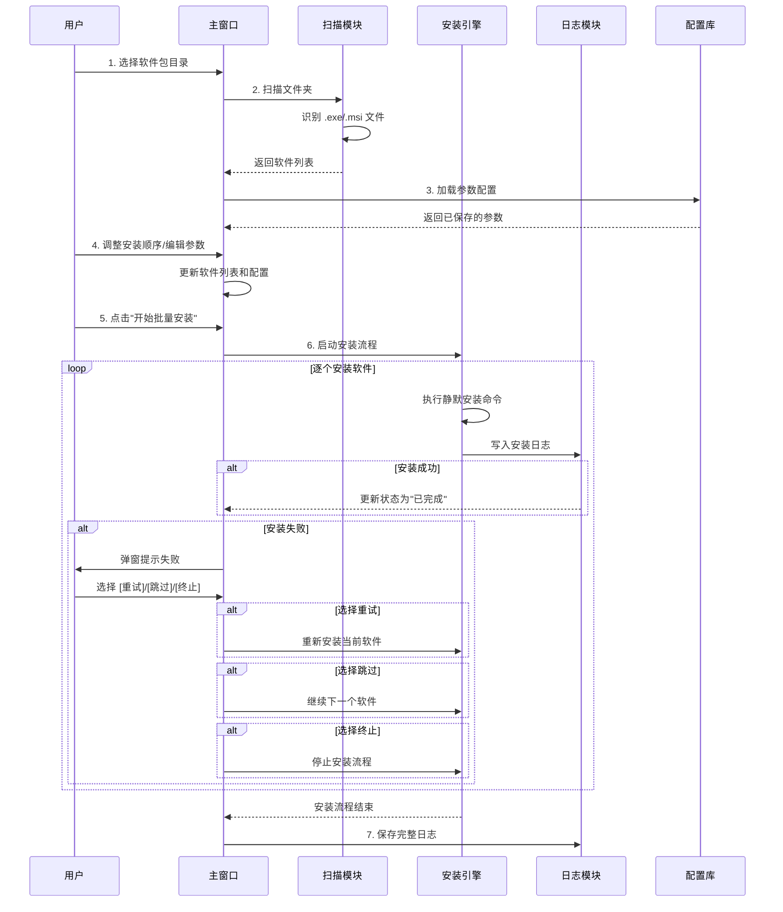

# 批量软件安装工具 - 产品需求文档 (PRD)

---

## 一、产品路线图

### 核心目标 (Mission)
打造一款让电脑维护员只需拖入软件包即可实现一键批量静默安装的效率工具。

### 用户画像 (Persona)
**目标用户：** 电脑维护员 / IT运维人员 / 重装系统工程师

**核心痛点：**
- 手动一个个安装软件繁琐重复，20+软件要耗费大量时间
- 不同的安装包静默安装参数不同，难以记忆
- 安装顺序混乱，导致依赖软件安装失败
- 缺少运行库导致部分软件无法正常运行

### V1: 最小可行产品 (MVP)

| 功能模块 | 具体功能 | 优先级 |
|---------|---------|--------|
| **1. 软件包导入** | 扫描指定文件夹，自动识别 .exe / .msi 文件 | P0 |
| **2. 参数配置库** | 为每个软件预设/编辑静默安装参数 | P0 |
| **3. 安装顺序管理** | 拖拽调整软件的安装顺序 | P0 |
| **4. 运行库内置** | 预置常见运行库（VC++ 2015-2022、.NET Framework 3.5/4.x） | P0 |
| **5. 批量安装执行** | 串行执行安装，显示进度 | P0 |
| **6. 安装日志** | 记录每个软件的安装结果和错误信息 | P0 |
| **7. 失败处理** | 安装失败时弹窗提示：重试 / 跳过 / 终止 | P0 |
| **8. 自定义安装路径** | 可选择每个软件的安装目录 | P1 |

### V2 及以后版本 (Future Releases)

| 功能 | 描述 |
|------|------|
| **Win11 支持** | 适配 Windows 11 系统特性 |
| **配置多套方案** | 保存多套安装方案（如"办公机"、"开发机"） |
| **远程安装** | 支持局域网远程批量部署到多台电脑 |
| **配置导入/导出** | 分享和复用配置方案 |
| **静默参数智能推荐** | 自动识别软件类型，推荐合适的静默参数 |
| **安装前后脚本** | 支持运行自定义批处理脚本 |
| **静默检测工具** | 自动检测未知软件的静默安装参数 |

### 关键业务规则 (Business Rules)

1. **安装执行顺序**：按列表顺序串行安装，上一个安装完成才执行下一个
2. **运行库优先**：运行库始终排在最前面安装
3. **失败处理策略**：默认"跳过"，用户可手动选择"重试"或"终止"
4. **日志保存**：每次安装生成日志文件，记录时间、软件名、状态、错误信息
5. **参数配置持久化**：用户配置的参数保存在本地，下次启动自动加载

### 数据契约 (Data Contract)

| 数据类型 | 存储方式 | 说明 |
|---------|---------|------|
| 软件列表 | JSON文件 | 软件名、路径、参数、顺序 |
| 安装日志 | TXT/LOG文件 | 时间戳、软件名、状态、错误详情 |
| 运行库 | 内置在软件目录 | VC++、.NET 等 |

---

## 二、MVP 原型设计

### 选定的原型：理念一 - 极简列表式

```
┌─────────────────────────────────────────────────────────────────┐
│  ▌ 批量软件安装工具                              [_][□][X]      │
├─────────────────────────────────────────────────────────────────┤
│                                                                 │
│  📁 软件包文件夹: [ C:\InstallPackages        ] [浏览...]      │
│                                                                 │
│  ┌─────────────────────────────────────────────────────────┐   │
│  │ # │ 软件名称              │ 类型  │ 状态    │ 操作       │   │
│  ├───┼──────────────────────┼───────┼─────────┼────────────┤   │
│  │ 1 │ vcredist_2015-2022   │ .exe  │ 待安装   │ [编辑][↑↓] │   │
│  │ 2 │ dotnetfx35           │ .msi  │ 待安装   │ [编辑][↑↓] │   │
│  │ 3 │ Chrome               │ .exe  │ 待安装   │ [编辑][↑↓] │   │
│  │ 4 │ VSCode               │ .exe  │ 待安装   │ [编辑][↑↓] │   │
│  │ 5 │ 7zip                 │ .exe  │ 待安装   │ [编辑][↑↓] │   │
│  └─────────────────────────────────────────────────────────┘   │
│                                                                 │
│  [⟳ 扫描文件夹]  [🗑 清空列表]                                  │
│                                                                 │
│  ┌─────────────────────────────────────────────────────────┐   │
│  │ 安装日志                                                  │   │
│  │ ─────────────────────────────────────────────────────── │   │
│  │ [10:30:01] 开始安装 vcredist_2015-2022...              │   │
│  │ [10:30:15] ✓ vcredist_2015-2022 安装完成               │   │
│  │ [10:30:15] 开始安装 dotnetfx35...                      │   │
│  └─────────────────────────────────────────────────────────┘   │
│                                                                 │
│                    ╔═══════════════════╗                       │
│                    ║   ▶ 开始批量安装  ║                       │
│                    ╚═══════════════════╝                       │
│                                                                 │
└─────────────────────────────────────────────────────────────────┘
```

### 设计说明

- **布局**：上下结构，上方为软件列表和工作按钮，中间为日志区域，底部为大尺寸开始按钮
- **交互**：
  - 点击"浏览"选择软件包目录
  - 点击"扫描文件夹"自动识别 .exe 和 .msi 文件
  - 每行右侧的[↑][↓]按钮调整顺序
  - [编辑]按钮弹出参数配置对话框
- **日志**：实时滚动显示安装状态，失败时显示红色错误信息
- **失败处理弹窗**：
  ```
  ┌────────────────────────────────────┐
  │  ⚠ 安装失败: Chrome.exe            │
  │                                    │
  │  错误信息: 安装程序返回非零退出码   │
  │                                    │
  │  [重试]  [跳过]  [终止全部]         │
  └────────────────────────────────────┘
  ```

---

## 三、架构设计蓝图

### 1. 核心流程图



### 2. 模块结构

```
项目结构:
├── src/
│   ├── main.py                 # 程序入口
│   ├── ui/
│   │   ├── main_window.py      # 主窗口界面
│   │   ├── dialogs/
│   │   │   ├── edit_params_dialog.py  # 参数编辑对话框
│   │   │   └── error_dialog.py         # 失败处理弹窗
│   │   └── widgets/
│   │       ├── software_list.py       # 软件列表控件
│   │       └── log_panel.py            # 日志显示面板
│   ├── core/
│   │   ├── scanner.py           # 文件扫描模块
│   │   ├── installer.py         # 安装执行引擎
│   │   ├── config_manager.py    # 参数配置管理
│   │   └── runtime_libs.py      # 运行库管理
│   └── utils/
│       ├── logger.py            # 日志工具
│       └── silent_params.py    # 静默参数数据库
├── resources/
│   └── runtime_libs/           # 内置运行库
├── config/
│   ├── software_config.json     # 软件参数配置
│   └── default_params.json     # 默认静默参数库
├── logs/                       # 安装日志目录
└── README.md
```

### 3. 组件交互说明

| 模块 | 职责 | 与其他模块的调用关系 |
|------|------|-------------------|
| `main_window.py` | 主界面，协调各模块 | 调用 scanner, installer, config_manager |
| `scanner.py` | 扫描文件夹，识别安装包 | 被 main_window 调用 |
| `installer.py` | 执行静默安装命令 | 被 main_window 调用，写入 logger |
| `config_manager.py` | 读取/保存配置 | 被 main_window 调用，提供参数 |
| `logger.py` | 记录安装日志 | 被 installer 调用，输出到界面和文件 |
| `silent_params.py` | 内置静默参数库 | 被 config_manager 引用 |

### 4. 技术选型

| 组件 | 技术选型 | 理由 |
|------|---------|------|
| **开发框架** | Python + PyQt6 | 跨平台、成熟的GUI框架、静默安装执行方便 |
| **打包工具** | PyInstaller | 将Python程序打包为Windows .exe |
| **配置文件** | JSON | 轻量级、易于手动编辑 |
| **日志** | Python logging | 内置模块，支持文件和控制台输出 |

### 5. 技术风险与应对

| 风险 | 可能性 | 影响 | 应对措施 |
|------|--------|------|---------|
| **静默参数不生效** | 中 | 高 | 提供手动编辑功能，保留参数配置库让用户自定义 |
| **安装包依赖运行库失败** | 中 | 高 | MVP内置常见运行库，失败时提示用户手动安装 |
| **安装超时/卡住** | 低 | 中 | 设置安装超时机制，超时后提示用户跳过或重试 |
| **权限不足** | 低 | 高 | 检测管理员权限，不足时提示用户以管理员身份运行 |

---

## 四、技术细节确认

1. **静默参数预设**：由开发方预设常见软件的默认静默参数，用户可手动编辑
2. **运行库**：由用户提供安装包，放置在 `resources/runtime_libs/` 目录
3. **安装超时**：每个软件安装超时时间 120 秒

---

**文档版本：** V1.0
**生成日期：** 2026-02-22
**状态：** 已确认，开发中

